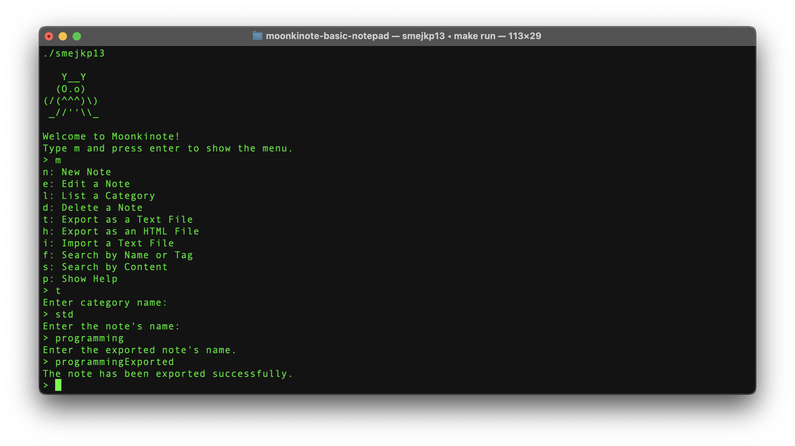

# Moonkinote - Basic Notepad

This is the first project I have ever done - 6/2019. The code is not very
clean or nice at all, but I thought I would still publish this project here.

The point was to create a program that would use modules instead of all source
code being in one file as well as stuff like polymorphism, I/O streams and files,
Makefile, documentation generation, etc.

### Original description:

----
===========================|| MOONKINOTE ||===========================
| DESCRIPTION: Moonkinote is a system for keeping notes. This small  |
| program offers creating notes of variable categories, exporting    |
| and imprting notes in a few formats, built-in text editor and more.|
----------------------------------------------------------------------
| INSTALLATION: You can install and run Moonkinote with Makefile.    |
| -> to compile program do 'make compile'                            |
| -> after compiling, you can run the program by 'make run'          |
| -> command 'make doc' generates documentation and saves it in /doc |
| -> by using just 'make' or 'make all' both doc and compile will    |
|    be done                                                         |
| -> in case you want to get back where you started, run command     |
|    'make clean'. This will delete the /doc folder as well as all   |
|    object files.                                                   |
----------------------------------------------------------------------
| HOW TO USE THE PROGRAM - all this and much more you can find after |
|                          launching the program and seeing help.    |
----------------------------------------------------------------------
----

Looking back, I see I got much better overall, especially at designing classes and organizing program structure (like using design patterns, good practices, etc.). Also the naming is not always perfect and some problems are solved in an unnecessary difficult way.

As I have already said, this was my first project so it is expected not to be good (being actually far from good, hehe).

---

### Example screenshots with description

#### Program start-up

After launching the program, you are greet with a interface where you use single char commands to navigate throughout the program.

#### New note creation

The screenshot below shows creating of a new note. To create a new note you have to provide its category (there are three categories - std, shopping, todo). Also when a new note is being created, you are able to add some tags that can be later used when searching for a specific note. You can find a note
based on its content as well.

image::examples/screenshots/note_creation.png[alt=Note Creation, width=1180]

#### Note editor

If you decide to edit a note of category 'std' you will be provided with a simple vim-like interface, that allows you to edit & save the note.

#### Note deletion

Deleting a note is done by providing note's category and name.

image::examples/screenshots/note_deletion.png[alt=Note Deletion, width=1180]

#### TODO note

TODO note is one of the three provided categories of notes. The notes help you manage your tasks by creating a list of them, in which you can tick off records that you have already done. Check out the screenshot below to see the interface yourself. Note: The shopping category is very similar except for a few small differences.

#### Export note to .txt file

You are also able to export your note to either .txt or to .html file. I'm going to show you the process and result of exporting to .txt. At first, you have to choose a note to be exported. That's done by providing its category and name. Then you have to specify the note's name after export. After that the note will be exported and kept in ./src/Exported/ (don't ask me why I choose this location, idk).

You can see the result in the screenshot below.

